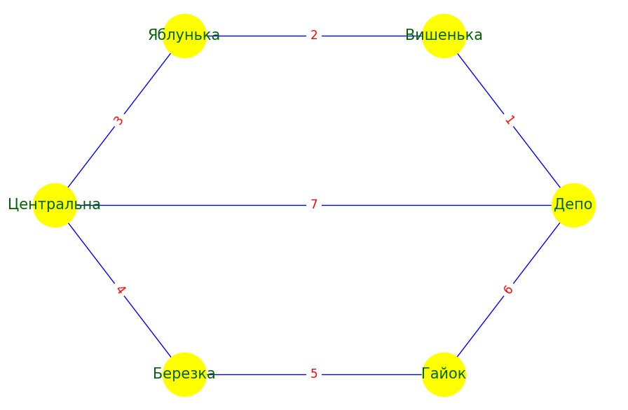

## Висновки

### Завдання 1:

#### Схема руху дитячої залізниці в Києві з нумерацією ребер



**Проведено аналіз графа, а саме наступні показники:**

1. **Number of nodes (кількість вузлів):**
   Кількість вузлів дорівнює 6, що означає, що у графі є 6 станцій дитячої залізниці. Це показує загальну кількість станцій, що представлені у мережі.

2. **Number of edges (кількість ребер):**
   Кількість ребер дорівнює 7, що означає, що у графі є 7 з'єднань між станціями. Це показує загальну кількість зв'язків між станціями у мережі.

3. **Степінь вузла (node degree):**
   Степінь вузла визначається як кількість ребер, що виходять з цього вузла. Наприклад:

| Станція    | Степінь | З'єднання з іншими станціями |
| ---------- | ------- | ---------------------------- |
| Депо       | 3       | Вишенька, Центральна, Гайок  |
| Вишенька   | 2       | Депо, Яблунька               |
| Яблунька   | 2       | Вишенька, Центральна         |
| Центральна | 3       | Яблунька, Березка, Депо      |
| Березка    | 2       | Центральна, Гайок            |
| Гайок      | 2       | Березка, Депо                |

4. **Кінцеві станції:**
   Вузли зі степенем 1 відсутні у нашому графі. Це означає, що у нашій мережі немає кінцевих станцій, тобто станцій, які мають лише одну суміжну станцію.

5. **Перехідні вузли:**
   Вузли зі степенем 2 є звичайними проміжними станціями:

- "Яблунька" та "Березка" мають степінь 2, що є типово для більшості станцій на прямій лінії залізниці.

6. **Станції пересадок:**
   Вузли зі степенем 3 є станціями пересадок:

- "Депо" та "Центральна" мають степінь 3, що означає, що це важливі вузли з кількома з'єднаннями в мережі.

### Завдання 2:

## Реалізація алгоритмів DFS та BFS

### Реалізація алгоритмів

Були реалізовані два ключові алгоритми для знаходження шляхів у графі:

1. **Алгоритм пошуку в глибину (DFS)**:
   DFS працює за принципом глибокого обходу графа, де спочатку досліджуються всі вузли з найближчого виходу, а потім переходять до наступного.

2. **Алгоритм пошуку в ширину (BFS)**:
   BFS досліджує граф рівнями, починаючи з найближчих сусідів до початкової вершини та переходячи до більш віддалених.

### Результати виконання алгоритмів

```python
DFS Path: ['Депо', 'Центральна', 'Березка', 'Гайок', 'Яблунька', 'Вишенька']
BFS Path: ['Депо', 'Вишенька', 'Гайок', 'Центральна', 'Яблунька', 'Березка']
```

## Висновки

- DFS (пошук в глибину) та BFS (пошук в ширину) зазвичай дають різні результати, оскільки вони використовують різні стратегії для пошуку шляхів у графі. Однак у випадку графу ліній метро міста Києва обидва алгоритми дають однаковий результат через наступні причини:

- Структура графу: Граф, який представляє схему руху дитячою залізницею, має досить лінійну структуру. Станції йдуть одна за одною у певному порядку, і обидва алгоритми можуть проходити ці станції у тому ж порядку.

- Послідовність вершин: У графі немає складних розгалужень або альтернативних шляхів між "Депо" та "Центральна". Тому обидва алгоритми проходять ті ж самі вершини в тому ж порядку.

- Цей випадок є особливим через просту та лінійну структуру графу, де різниця між DFS і BFS не проявляється. В інших графах з розгалуженнями або складними маршрутами результати можуть суттєво відрізнятися.

### Завдання 3:

## Реалізація алгоритму Дейкстри

Було реалізовано алгоритм Дейкстри для знаходження найкоротшого шляху у графі з вагами. Граф було оновлено з вагами на ребра, які представляють відстань між станціями.

### Результати

```python
Найкоротші шляхи між усіма парами вершин:
Від Депо до Вишенька: шлях ['Депо', 'Вишенька'], відстань 1
Від Депо до Яблунька: шлях ['Депо', 'Вишенька', 'Яблунька'], відстань 3
Від Депо до Центральна: шлях ['Депо', 'Центральна'], відстань 5
Від Депо до Березка: шлях ['Депо', 'Центральна', 'Березка'], відстань 8
Від Депо до Гайок: шлях ['Депо', 'Гайок'], відстань 4

```

## Висновки

- Алгоритм Дейкстри показує точні результати для всіх пар вершин у графі, враховуючи ваги ребер. Це дозволяє ефективно знаходити найкоротші шляхи між станціями дитячої залізниці.
